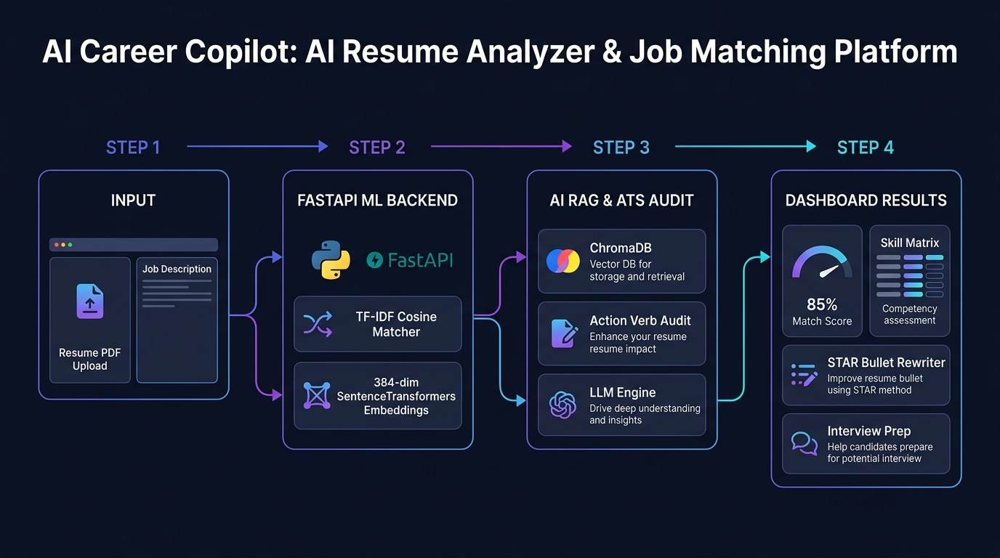
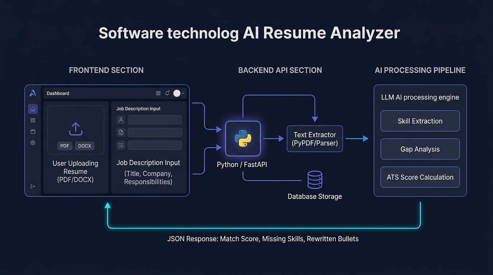
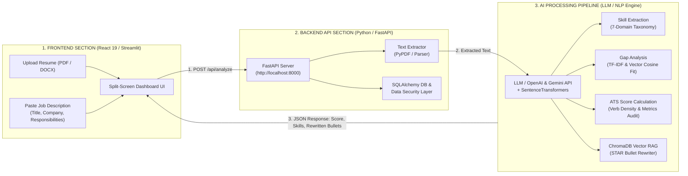

# 🚀 AI Career Copilot — Smart Resume Analyzer & Job Matching System

[](https://www.python.org/)
[](https://fastapi.tiangolo.com/)
[](https://streamlit.io/)
[](https://react.dev/)
[](https://tailwindcss.com/)
[](https://www.docker.com/)
[](LICENSE)

**AI Career Copilot** is a production-grade AI system designed to analyze candidate resumes against target job descriptions. Built with **React 19**, **Streamlit**, **FastAPI**, **Scikit-Learn**, **SentenceTransformers**, **ChromaDB Vector Store**, and **SQLAlchemy**, it provides real-time ATS match scoring, hybrid TF-IDF + Dense Vector embedding calculations, 7-domain skill gap analysis, STAR bullet point rewriting, and targeted interview question generation.

---

## 📸 End-to-End Project Workflow



### 4-Step Pipeline Breakdown:
1. **STEP 1 — Input & PDF Parsing**: Upload candidate resume PDF or paste plain text alongside target Job Title, Company Name, and Job Description.
2. **STEP 2 — FastAPI ML Engine**: Processes request via `POST /api/analyze`, computing **Sparse TF-IDF Cosine Similarity** & 384-dimensional **SentenceTransformers Dense Embeddings** (`all-MiniLM-L6-v2`).
3. **STEP 3 — AI RAG & ATS Audit**: Categorizes skills into a 7-domain technical taxonomy (*Frontend, Backend, AI/ML, Cloud, Data, Testing, Soft Skills*), audits action verb density/quantifiable metrics, and queries **ChromaDB Vector Store** for STAR bullet rewrites.
4. **STEP 4 — Interactive Results Dashboard**: Renders match score meters, skill matrix gaps, ATS feedback recommendations, and tailored interview Q&A practice.

---

## 📐 System Architecture Diagram





---

## ✨ Key Features

- 📄 **Privacy-First PDF Text Extraction**: Uses `pdfjs-dist` worker client-side and `pypdf` server-side to extract text safely without cloud lock-in.
- 🎨 **Dual Frontend Options**:
  - **Vite React 19 UI** (`http://localhost:5173`): Modern glassmorphism dark UI with Tailwind CSS v4, Lucide icons, and Recharts.
  - **Streamlit Python UI** (`http://localhost:8501`): Responsive, 100% Python-native dashboard supporting Mobile (375px), Tablet (768px), and Desktop viewports.
- 🧮 **Hybrid ML Matching Engine**:
  - **Sparse TF-IDF Cosine Similarity**: Calculates term importance match percentage.
  - **Dense Vector Embeddings**: Computes 384-dimensional semantic similarity using `all-MiniLM-L6-v2` (`SentenceTransformers`) to capture conceptual relevance (e.g. "Cloud Infrastructure" $\leftrightarrow$ "AWS DevOps").
- 🎯 **7-Domain Skill Matrix**: Categorizes technical skills into *Frontend*, *Backend*, *Databases*, *AI/ML*, *DevOps*, *Testing*, and *Soft Skills* with priority tags (`Critical` vs `Good to Have`).
- ⚡ **RAG & Vector Database**: Utilizes **ChromaDB** vector database to index and retrieve STAR bullet templates matching candidate skill gaps.
- 📝 **STAR Bullet Rewriter**: Transforms weak resume bullet points into high-impact metric statements.
- ❓ **Tailored Interview Prep**: Generates role-specific technical, behavioral, and gap mitigation interview practice questions with model answer hints.
- 💾 **Data Persistence & History**: Persists candidate analysis runs using **SQLAlchemy ORM** accessible via `/api/history`.
- 🔐 **JWT Token Authentication**: Built-in Bearer JWT authentication endpoints (`/api/auth/token`).
- 🐳 **Dockerized Production Deployment**: Multi-stage Docker containers for frontend (Nginx) and backend (Uvicorn) with `docker-compose.yml`.

---

## 🛠️ Technology Stack

| Layer | Technology |
| :--- | :--- |
| **Frontend UI Options** | **React 19**, Vite 6, Tailwind CSS v4, **Streamlit 1.64**, Lucide React, Recharts |
| **Backend API** | Python 3.12, FastAPI, Uvicorn, Pydantic v2, Pytest, HTTPX |
| **ML & NLP Engine** | Scikit-Learn (TF-IDF Vectorizer, Cosine Similarity), SentenceTransformers (`all-MiniLM-L6-v2`) |
| **Vector DB & RAG** | ChromaDB Persistent Vector Store |
| **Database ORM** | SQLAlchemy (SQLite for local dev, PostgreSQL ready) |
| **Authentication** | Bearer JWT (JSON Web Tokens) |
| **Containerization** | Docker, Docker Compose, Nginx Multi-stage builds |

---

## 🚀 Quickstart & Setup

### Option 1: Docker Compose (Recommended)

Run the full-stack containerized application with one command:

```bash
docker-compose up --build
```
- **React Frontend**: [http://localhost:5173](http://localhost:5173)
- **FastAPI Backend**: [http://localhost:8000](http://localhost:8000)

---

### Option 2: Local Development Setup

#### 1. Start Python FastAPI ML Backend

```bash
cd backend
python -m venv venv
# On Windows:
.\venv\Scripts\activate
# On Linux/macOS:
# source venv/bin/activate

pip install -r requirements.txt
uvicorn app.main:app --host 127.0.0.1 --port 8000 --reload
```
- Backend API Docs: [http://localhost:8000/docs](http://localhost:8000/docs)
- Health Check: [http://localhost:8000/api/health](http://localhost:8000/api/health)

#### 2. Start Vite React Frontend

```bash
npm install
npm run dev
```
- React Dashboard: [http://localhost:5173](http://localhost:5173)

#### 3. Start Responsive Streamlit Python Frontend

```bash
.\backend\venv\Scripts\python.exe -m streamlit run streamlit_app.py --server.port 8501 --server.address 127.0.0.1
```
- Streamlit Dashboard: [http://localhost:8501](http://localhost:8501)

---

## 🧪 Running Automated Tests

Run the full pytest suite across health, matching, database, RAG vector store, and auth routes:

```bash
.\backend\venv\Scripts\python.exe -m pytest backend/tests -v
```

---

## 📜 License

Distributed under the MIT License. See `LICENSE` for details.
